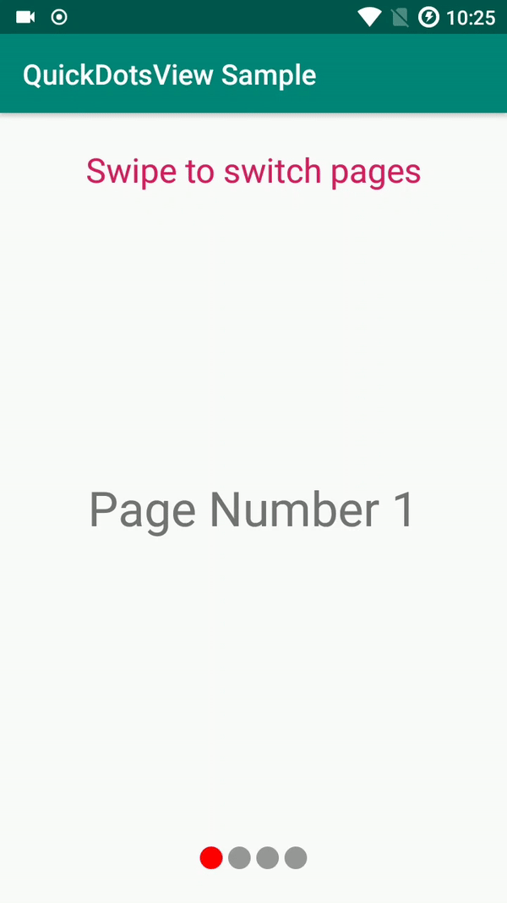

[](https://travis-ci.org/radusalagean/quick-dots-view)


# QuickDotsView

Android library that enables users to include configurable dot indicators in their projects, with built-in linking support for `ViewPager`.



## Usage

Include the library in your module-level `build.gradle` file:
```
dependencies {
        implementation 'com.radusalagean:quickdotsview:1.0.0'
}
```

Define the view in XML:
```xml
<com.radusalagean.quickdotsview.QuickDotsView
        android:layout_width="wrap_content"
        android:layout_height="wrap_content"
        android:id="@+id/quick_dots_view" />
```

### Linking with a `ViewPager`

In order to link `QuickDotsView` with a `ViewPager` instance, call:

```java
quickDotsView.linkViewPager(viewPager);
```

You can call this method only after the `PagerAdapter` has been set to your `ViewPager`. 

Once they are linked, `QuickDotsView` will respond automatically to events such as chainging the page or attaching a different `PagerAdapter` to the `ViewPager`. The `count` and `currentDot` properties will be updated automatically.

If you want to unlink them, you can call the `unlinkViewPager(ViewPager)` method on the `QuickDotsView` instance.

The sample app included in the repo showcases an example of such an implementation.

### Custom XML attributes

| Attribute | Description | Default value |
| --- | --- | --- |
| `count` | The total number of dots to be displayed (value must be equal or higher than 1) | `1` |
| `selectedDotColor` | Color to be used for the drawing the selected dot |  `#FFFF0000` |
| `unselectedDotColor` | Color to be used for the drawing the unselected dot |  `#65000000` |
| `dotRadius` | The radius size of the dot | `8dp` |
| `dotSeparation` | The distance between dots | `4dp` |
| `currentDot` | The 0-based position of the currently selected dot | `0` |

#### Custom XML attibutes usage example
```xml
<com.radusalagean.quickdotsview.QuickDotsView
        android:layout_width="wrap_content"
        android:layout_height="wrap_content"
        android:id="@+id/quick_dots_view"
        app:selectedDotColor="@color/colorAccent"
        app:unselectedDotColor="@color/colorPrimary"
        app:dotRadius="4dp"
        app:dotSeparation="8dp" />
```

## License
Apache License 2.0, see the [LICENSE](LICENSE) file for details.
